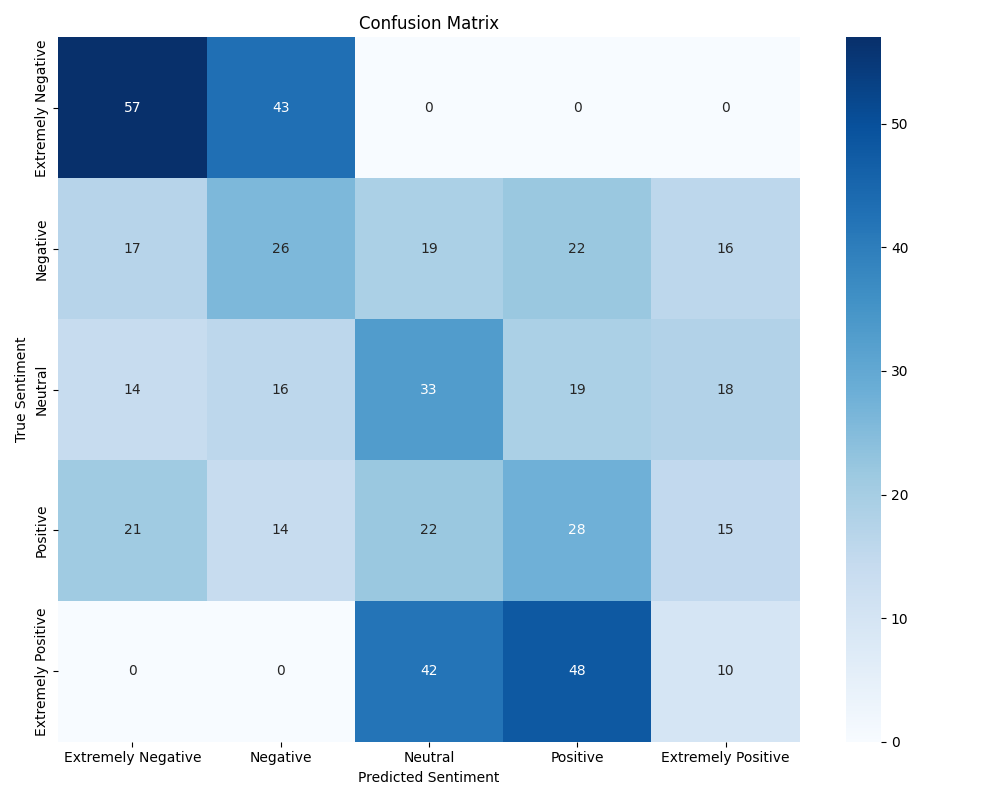

# EvoPrompt: Optimizing Prompts for Sentiment Analysis using Evolutionary Algorithms and Large Language Models

## 🔍 Introduction 🔍

Large Language Models (LLMs) are highly effective for various tasks but require carefully designed prompts. This process often demands significant manual effort, as there is no universal prompt that works across all LLMs. This project, based on a paper: Connecting **Large Language Models with Evolutionary Algorithms Yields Powerful Prompt Optimizers** - 
_Qingyan Guo, Rui Wang, Junliang Guo, Bei Li, Kaitao Song, Xu Tan, Guoqing Liu, Jiang Bian, Yujiu Yang_ introduces **EvoPrompt**, a novel framework for automating prompt optimization using Evolutionary Algorithms (EAs).

EAs are known for their efficiency and fast convergence, making them ideal for this task. By integrating LLMs with EAs, EvoPrompt combines the advanced language processing capabilities of LLMs with the optimization efficiency of EAs. EvoPrompt enables EAs to operate on discrete prompts, which are natural language expressions that must remain coherent and human-readable. Starting with an initial population of prompts, EvoPrompt iteratively generates new prompts based on evolutionary operations, and then they are evaluated on a given test set. If their results are better than the initial prompts, based on which it was created, a new prompt is being inserted on the place of the worst base prompt result.

---

## 🚀 Iteration process & elements of the cycle 🚀

### Prerequisites
- **Initial Prompts**: A starting set of prompts (`P₀`), stored in the file **_prompts_examples.json_** splitted on prompts written manually and generated by an LLM.
  
- **Development Set**: Dataset (`D`) for testing the prompts. In the project the **COVID-19 tweets dataset** (https://www.kaggle.com/datasets/datatattle/covid-19-nlp-text-classification) where each record was labeled with sentiment classes: Extremely Negative, Negative, Neutral, Positive, Extremely Positive creating an evaluation problem of a 5-class classification.
  
- **Scoring Function (`fᴰ`)**: Measures prompt performance on the LLM using `D`. Function of scoring used - **accuracy**.
  
- **Iterations (`T`)**: Number of optimization cycles. For each case examined, T was set to **20**.
  
- **Evolution Operator (`Evo`)**: Generates new prompts by combining or mutating parent prompts. There were 2 methods of evolution used - **Genetic Algorithm & Differential Evolution**.
  
- **Large Language Model**: A main component responsible for processing evolutionary operations, creating new prompt and assessing the label for a given data record - Model **Phi-3.5** was used, from the **Ollama library**.

  
### Evolutionary Process
1. **Initial Evaluation**: Measure the accuracy of initial prompts using the scoring function.

3. **Selection**: Pick parent prompts randomly.
   
5. **Evolution**: Generate a new prompt by evolutionary operations over parents using templates (**_template_de.py, template_de_adjusted.py_, template_ga_adjusted.py**.
   
7. **Evaluation**: Assess the new prompt using the scoring function.
   
8. **Update Population**: Replace less effective prompt with new one based on accuracy score.
   
10. **Repeat**: Iterate the process for `T` cycles.
    
12. **Final Output**: Return the best-performing prompt.

---

## 🔧 Main files 🔧

1. **_Covid_ds_EDA.ipynb_**:
   - Exploratory Data Analysis of the dataset
   - Examining & cleaning it from unnecessary columns & NaN values
   - Creating the balanced set of **2000 samples**, equally splitted to 400 samples per class
     
2. **_prompts_examples.json_**:
   - Initial prompts stored in the json file, splitted onto _written_prompts_ (4 samples) and _generated_prompts_ (5 samples)
     
3. **_templates_de.py, templates_de_adjusted.py, templates_ga_adjusted.py_**:
   - Prompts templates for evolution processes, with schemas written step by step for the model
     
4. _**generated_prompts_tests.ipynb, written_prompts_tests.ipynb**_
   - Test environment of initial prompts (written / generated), to evaluate them, and use as a benchmark for evolutionary methods
   - Testing different models from Ollama package, and tuning their parameters to maximize accuracy.
   - Plotting results into confussion matrix saved as .png files with proper names in **_results_graphs_/prompts_results** folder
   - Saving prompts and their results into logs, stored in _**logs_Results**_ folder
     
5. _**evo_prompt.py**_  
   - **`__init__`**: Initializes the evolutionary prompt optimization process, setting up the population, scoring function, iteration count, and evolutionary method (GA or DE).  
   - **`generate_prompt`**: Communicates with the LLM to generate a response based on the provided prompt content.  
   - **`select_parents`**: Randomly selects parent prompts for the next iteration based on the evolutionary method and prompt source.  
   - **`evolve_ga`**: Implements genetic algorithm operators (crossover and mutation) to create a child prompt from selected parent prompts.  
   - **`evolve_de`**: Executes differential evolution by combining selected parent prompts to create a new prompt using pre-defined templates.  
   - **`evolve`**: Directs the evolution process to the appropriate method (`evolve_ga` or `evolve_de`).  
   - **`update_population`**: Replaces the least effective prompt in the population with a better-performing new prompt if applicable.  
   - **`return_prompts`**: Returns the current population of prompts with their evaluation scores.  
   - **`save_to_logs`**: Logs the results of each iteration, including new prompts, accuracy scores, and invalid sample counts, all stored in a _**logs_results_evoprompt**_.  
   - **`optimize`**: Manages the optimization process over a specified number of iterations, calling evolution, evaluation, and update functions.  
   - **`plot_score_progression`**: Plots and saves a linear graph showing accuracy score progression across iterations, stored with unique name as .png files into **_results_graphs_/evoprompt_results** folder.  
   - **`plot_conf_matrix`**: Generates and saves a confusion matrix visualization based on true and predicted sentiment labels. Graphs are stored with unique name as .png files into **_results_graphs_/evoprompt_results** folder.
     
6. **_evo_prompt_test.ipynb_**
   - Test environment, similar to _**generated_prompts_tests.ipynb**_ with **_evaluation_function_** included
   - Creating **_test_set.csv_** with 500 samples, balanced, that GA & DE methods results were tested on.

---

## 📈 Results

### Baseline Prompt

All prompts were evaluated on 2000 samples.

Written prompt               | Generated prompt
:----------------------------:|:----------------------------:
**Mean Accuracy:** 25.64%    | **Mean Accuracy:** 19.3%
**Best Accuracy:** 31.15%    | **Best Accuracy:** 19.4%
 | 
Written prompt based model is biased toward "Negative" or "Extremely Negative" classifications and struggles to distinguish boundaries between sentiments. 
On the other hand, generated prompt has significant misclassifications, with predictions concentrated in "Neutral" and "Positive" categories, and difficulty in distinguishing extreme sentiments.

### Genetic Algorithm (GA) Results

Written prompt            |  Generated prompt
:-------------------------:|:-------------------------:
Best accuracy: **30.2%**  | Best accuracy: **30.8%**
  |  

The confusion matrix for written prompts shows more accurate predictions, with a better focus along the diagonal. Misclassifications are less spread out, especially for Neutral and Positive sentiments, indicating that written prompts help the model better understand these categories.  

The confusion matrix for generated prompts reveals more mistakes, with predictions often mixing up similar categories. For instance, Extremely Positive is frequently confused with Positive, and Extremely Negative with Negative, indicating challenges in classifying edge cases.

---

Written prompt            |  Generated prompt
:-------------------------:|:-------------------------:
  |  

The accuracy progression plot for written prompts shows steady improvement over the first few iterations, peaking at an accuracy of **0.302** around iteration 15. After this point, the accuracy stabilizes.  

The plot for generated prompts indicates slower initial improvement, starting at a lower value. Accuracy reaches **0.31** by iteration 3 and remains stable afterward. Despite achieving a comparable final accuracy, the generated prompts exhibit less variation and slower early improvement, suggesting less effective optimization.

---

### Differential Evolution (DE) Results

Template prompt v1           |  Template prompt v3
:-------------------------:|:-------------------------:
Best accuracy: **28.6%**  | Best accuracy: **30.5%**
  |  

Template Prompt v1 demonstrates a broader spread of misclassifications, particularly for Neutral and adjacent categories, indicating difficulty in handling extreme classes.

Template Prompt v3 outperforms v1, showing higher accuracy and more consistent classifications, especially for extreme sentiments like Extremely Negative and Extremely Positive.

---

Template prompt v1           |  Template prompt v3
:-------------------------:|:-------------------------:
  |  

The accuracy progression for Template Prompt v1 shows a more gradual improvement with smaller accuracy gains over time.  

Template Prompt v3 achieves higher accuracy earlier in the iterations and stabilizes faster, maintaining consistent performance after reaching its peak. V3 demonstrates a more efficient optimization process compared to v1.

## 🛠 Challenges of the project 🛠

1. **Model Parameters**:
   - Identifying optimal models and their LLM hyperparameter configurations.
2. **Instruction Adherence**:
   - Ensuring models stick to provided templates.
3. **Handling Invalid Samples**:
   - Filtering out cases where no numerical output was generated by the model (not a single number, often random text or punctuation marks).
4. **Simplifying Templates**:
   - Making DE templates more concise and LLM-friendly, as model couldn't analyse so many tokens at once.
5. **Mitigating Hallucinations**:
   - Addressing inaccuracies during DE prompt generation.

---

## ✅ Conclusions ✅

- EvoPrompt achieved accuracy rates oscillating around 31%, outperforming random guess (20%) and initial prompts (written and generated) mean accuracies.
- Although the best single result was acquired by written initial prompt, it cannot be treated as the best prompt, as it was unstable in its generations.
- By using EvoPrompt, model's accuracy was raised by over **5%** in total accuracy.
- In all experiments, confusion matrixes shown that model has the biggest problem in recognizing classes sentimentally close to each other (Extremely Negative - Negative & Extremely Positive - Positive)

